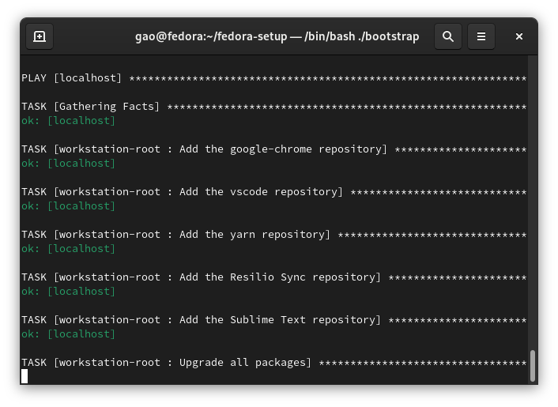

# fedora-setup
Mike's Fedora Setup Scripts



To run this setup, clone the repository or download a zip version, and run ``./bootstrap``. Remember to enter your root password when prompted `BECOME password`.

If you are running a system with no NVIDIA graphics card, go to ``roles/workstation-root/tasks/main.yml`` and comment out ``nvidia.yml``.

After running the ansible script, modify ``/etc/default/grub`` to add ``mitigations=off`` and then ``sudo grub2-mkconfig -o /boot/grub2/grub.cfg``

To install the vscode extensions I use, run:

```
code --install-extension bierner.markdown-preview-github-styles
code --install-extension budparr.language-hugo-vscode
code --install-extension denoland.vscode-deno
code --install-extension denoland.vscode-deno-canary
code --install-extension esbenp.prettier-vscode
code --install-extension foxundermoon.shell-format
code --install-extension golang.go
code --install-extension James-Yu.latex-workshop
code --install-extension ms-python.python
code --install-extension ms-python.vscode-pylance
code --install-extension ms-toolsai.jupyter
code --install-extension ms-vscode.cpptools
code --install-extension njpwerner.autodocstring
code --install-extension redhat.java
code --install-extension redhat.vscode-commons
code --install-extension redhat.vscode-xml
code --install-extension redhat.vscode-yaml
code --install-extension rust-lang.rust
code --install-extension slevesque.shader
code --install-extension syler.sass-indented
code --install-extension sysoev.language-stylus
code --install-extension VisualStudioExptTeam.vscodeintellicode
code --install-extension vscjava.vscode-java-debug
code --install-extension vscjava.vscode-java-dependency
code --install-extension vscjava.vscode-java-pack
code --install-extension vscjava.vscode-java-test
code --install-extension vscjava.vscode-maven
```

Remember to backup ``~/.ssh``, ``~/.gnupg``, ``~/.config``, ``~/.gitconfig`` and optionally the ``/opt`` folder

``tar -czvf dotfiles.tar.gz .gnupg/ .local/share/applications/filezilla.desktop .local/share/applications/deltawalker.desktop  .local/share/applications/thinkorswim.desktop  .gitconfig .ssh/ .config/google-chrome/``
