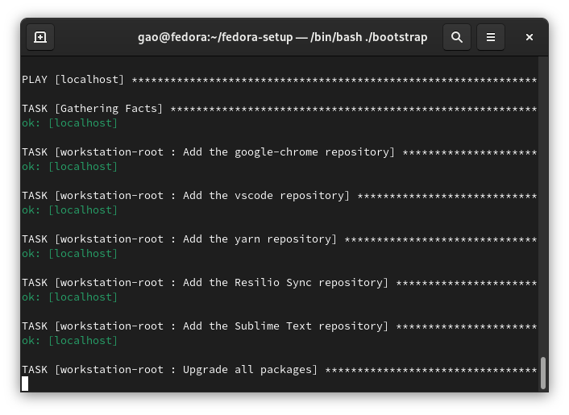

# fedora-setup
Mike's Fedora Setup Scripts

To run this setup, clone the repository or download a zip version, and run ``./bootstrap``. Remember to enter your root password when prompted `BECOME password`.

If you are running a system with no NVIDIA graphics card, go to ``roles/workstation-root/tasks/packages.yml`` and comment out all the NVIDIA related packages.

Remember to backup ``~/.ssh``, ``~/.gnupg``, ``~/.config``, ``~/.gitconfig`` and the ``/opt`` folder
